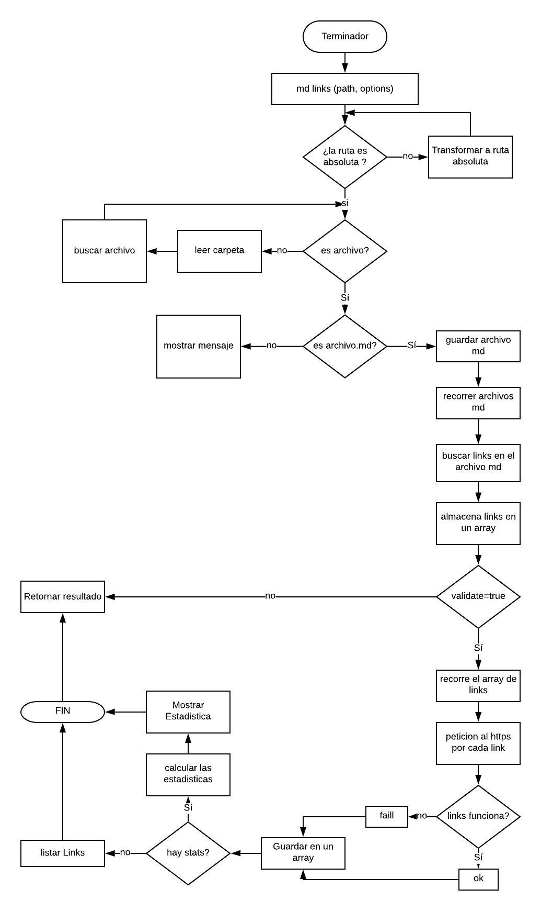

# Markdown Links

## Preámbulo

[Markdown](https://es.wikipedia.org/wiki/Markdown) es un lenguaje de marcado
ligero muy popular entre developers. Es usado en muchísimas plataformas que
manejan texto plano (GitHub, foros, blogs, ...), y es muy común
encontrar varios archivos en ese formato en cualquier tipo de repositorio
(empezando por el tradicional `README.md`).

Estos archivos `Markdown` normalmente contienen _links_ (vínculos/ligas) que
muchas veces están rotos o ya no son válidos y eso perjudica mucho el valor de
la información que se quiere compartir.

Dentro de una comunidad de código abierto, nos han propuesto crear una
herramienta usando [Node.js](https://nodejs.org/), que lea y analice archivos
en formato `Markdown`, para verificar los links que contengan y reportar
algunas estadísticas.


## Consideraciones generales

- La librería esta implementada en JavaScript para ser ejecutada con
Node.js.

- El módulo debe ser instalable via `npm install mi19her/md-links`. Este
módulo incluye un _ejecutable_ que podamos invocar en la línea de
comando, es como una interfaz que podamos importar con `require` para usarlo
programáticamente.

- Se utilizan tests unitarios como el Jest.

## Diagrama de Flujo

Se diseñó el diagrama de flujo para tener una información visual de la trayectoria del proceso, y así poder definir la arquitectura del proyecto.




## Board con el backlog para la implementación de la librería

Se utilizo GitHub como herramienta para la organizacion y planificacion del proyecto.


- Encontrar el *pseudo codigo* o *diagrama de flujo* con el algoritmo que
  soluciona el problema.
- Encontrar un board con el backlog para la implementación de la librería.
- Encontrar la documentación técnica de la librería.
- Encontrar la Guía de uso e instalación de la librería.

## Instalacion y Guia de uso de esta libreria

#### `Paso 1 - INSTALACION`: 
 - En tu linea de comando debes ejecutar `npm install mi19her/md-links` para instalar la libreria.

#### `Paso 2 - GUIA DE USO`:
- Expone un ejecutable `md-links`, al ejecutarse muestra este mensaje `ingrese una ruta <path-to-file>`
- El ejecutable implementa `--validate`.
- El ejecutable implementa `--stats`.
- El ejecutable implementa `--validate` y `--stats` juntos.


## Ejemplos de Uso de la libreria
#### `mdLinks(path, options)`

- `path`: Ruta absoluta o relativa al archivo o directorio. 
- `options`: Un objeto con las siguientes propiedades:
  * `validate`: Booleano que determina si se desea validar los links
    encontrados.


### md-links <ruta>

El ejecutable de nuestra aplicación ejecutara de la siguiente
manera a través de la terminal:

`md-links <path-to-file> [options]`

Por ejemplo:

```sh
$ md-links ./some/example.md
./some/example.md http://algo.com/2/3/ Link a algo
./some/example.md https://otra-cosa.net/algun-doc.html algún doc
./some/example.md http://google.com/ Google
```

#### Options

##### `--validate`

Si pasamos la opción `--validate`, el módulo hara una petición HTTP para
averiguara si el link funciona o no. Si el link resulta en una redirección a una
URL que responde ok, entonces consideraremos el link como ok.

Por ejemplo:

```sh13d99df067c1
$ md-13d99df067c1
./some/example.md http://algo.com/2/3/ ok 200 Link a algo
./some/example.md https://otra-cosa.net/algun-doc.html fail 404 algún doc
./some/example.md http://google.com/ ok 301 Google
```

Vemos que el _output_ en este caso incluye la palabra `ok` o `fail` después de
la URL, así como el status de la respuesta recibida a la petición HTTP a dicha
URL.

##### `--stats`

Si pasamos la opción `--stats` el output (salida) será un texto con estadísticas
básicas sobre los links.

```sh
$ md-links ./some/example.md --stats
Total: 3
Unique: 3
```

También podemos combinar `--stats` y `--validate` para obtener estadísticas que
necesiten de los resultados de la validación.

```sh
$ md-links ./some/example.md --stats --validate
Total: 3
Unique: 3
Broken: 1
```
